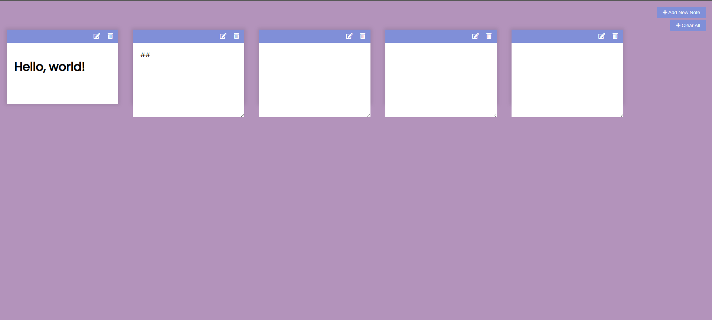

# Projeto My Notes

**Escreva as suas notas.**

## Resumo do projeto:

O projeto consiste em uma aplicação web divertida que permite aos usuários adicionar, editar e excluir notas de forma interativa. Utilizando HTML, CSS e JavaScript, a aplicação incorpora funcionalidades como a visualização de notas em um formato de caixa de texto e a persistência de dados por meio do armazenamento local (localStorage). O objetivo principal é oferecer aos usuários uma maneira simples e intuitiva de gerenciar as suas notas.

Um exemplo:

## Aplicação:

A aplicação é composta por um botão "Adicionar Nota", que, ao ser clicado, invoca a função addNewNote para criar uma nova nota.
Cada nota contém opções de edição e exclusão, proporcionando uma experiência de usuário flexível. Além disso, foi adicionado um recurso de "Remover Todas as Notas", permitindo a exclusão rápida de todas as notas existentes na página. A persistência dos dados é garantida pelo uso do localStorage, garantindo que as notas sejam mantidas entre as sessões. O usuário pode utilizar [Markdown](https://www.markdownguide.org/getting-started/) para escrever as notas.

## Linguagens usadas:

- 
- 
- 

## Documentação de cores

| Cor              | Hexadecimal                                                      |
| ---------------- | ---------------------------------------------------------------- |
| Background color |  #b393bb |
| Notes color      |  #808fd8 |
| Add/Clear button |  #808fd8 |

# Meus aprendizados nesse projeto:

**1. Manipulação do DOM:**

A prática intensiva de criar, modificar e excluir elementos do DOM (Document Object Model) proporcionou uma compreensão aprofundada da interação com a estrutura da página HTML.

**2. Persistência de Dados com localStorage:**

A utilização do localStorage para armazenar e recuperar dados localmente no navegador melhorou o meu entendimento sobre como manter a consistência dos dados entre as sessões do usuário.

**3. Interação com Eventos do Lado do Cliente:**

A implementação de funcionalidades como adicionar, editar e excluir notas envolveu a manipulação de eventos do lado do cliente, como cliques em botões, entrada de texto e outros eventos de interação.

**4. Edição em Tempo Real:**

A implementação da capacidade de editar notas em tempo real, alternando entre uma visão de texto e uma área de edição, consolidou o conhecimento sobre dinâmicas de atualização de conteúdo na interface do usuário.

**5. Remoção de Elementos em Massa:**

A adição da funcionalidade de remover todas as notas exigiu a manipulação eficiente de elementos HTML em massa, proporcionando insights sobre como lidar com coleções de elementos e otimizar operações de remoção.

## Etiquetas

